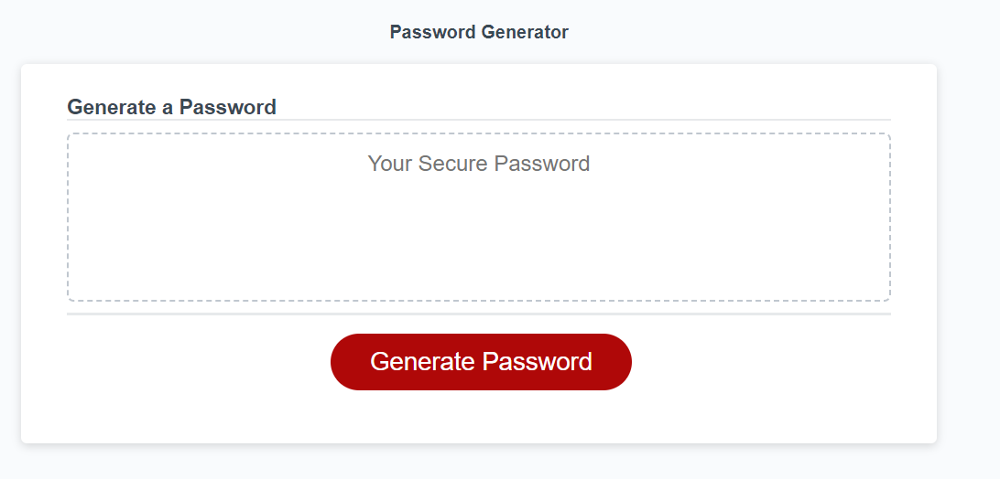

# JavaScript Random Password Generator

## Table of Contents
- [Description](#description)
- [What was learned?](#what-was-learned)
- [Website](#website)
- [Credits](#credits)
 

## Description
This is a random password generator created with JavaScript. The user is prompted with choices to include Lower case, Upper case, Numbers and Symbols in the password. The application itself generates a secure string between 8 and 128 characters for the user.
 

## What was learned?
While working on this I learned how to validate strings and also take input from users and assign it into variables I can use with different functions. Creating this application gave a great understanding of how nested loops and functions can be used together to create something useful. I look forward to tinkering with the code and adding new features to it as well as updating the CSS.
 

## Website
[The link to the deployed webpage can be found here](https://angadbatth.github.io/random-password-generator/)

 

## Credits

Sample Code given to us by BootCampSpot
[Mozilla Developer](https://developer.mozilla.org/en-US/)  
[W3 Schools](https://www.w3schools.com/)  
[Stack Overflow](https://stackoverflow.com/)  
Daler Singh  
Adam Nyx

